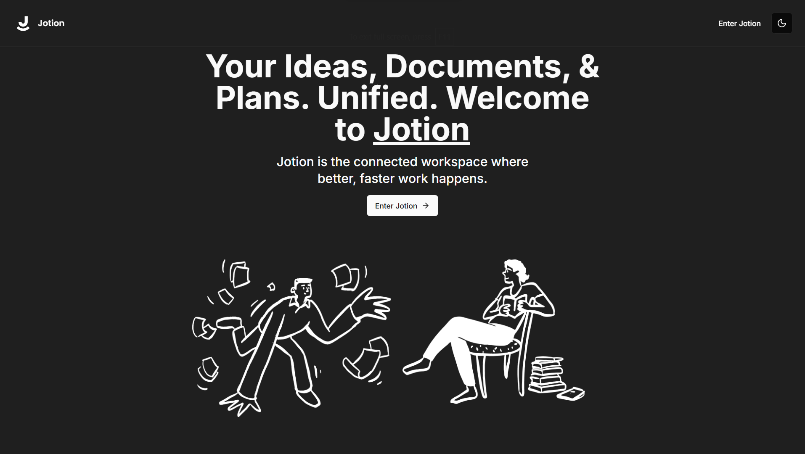
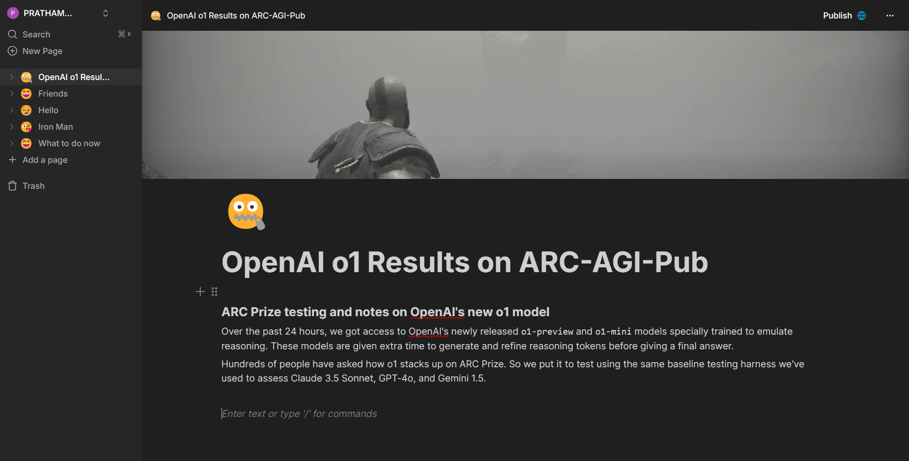
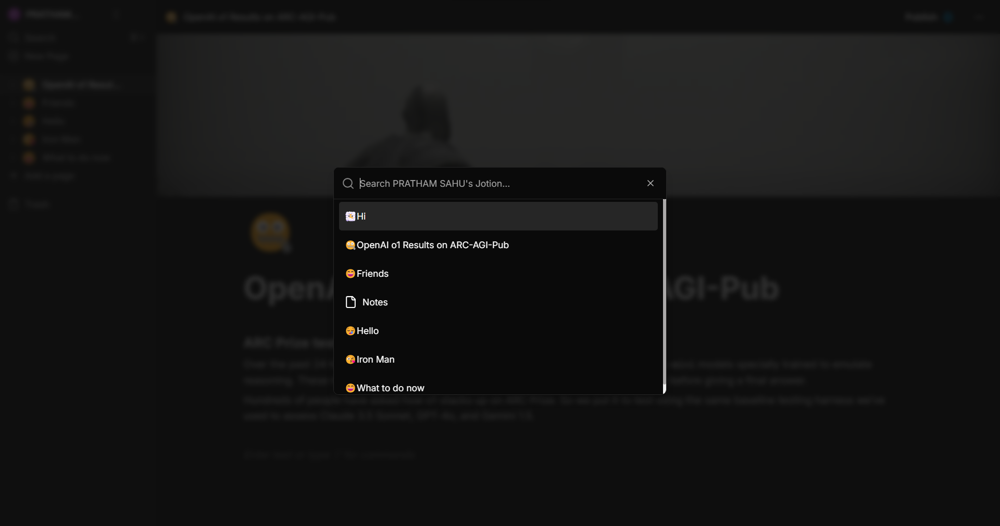

<p align='center'></p>


# 📝 Jotion - The Ultimate Note-taking and Task Management Website

**Jotion** is a versatile note-taking and task management platform that helps users create, organize, and manage their tasks, notes, and documents—all in one seamless workspace. With features like rich text editing, image uploads, and folder organization, it’s a powerful tool for boosting productivity and managing information efficiently.

Explore the live site: [Jotion on Vercel](https://jotion-3wex.vercel.app).

---

## Screenshots
1. Home Page
<p align='center'></p>

2. Editor
<p align='center'></p>

3. Search Dialog
<p align='center'></p>

---

## ✨ Key Features

- **Page Creation & Organization**: Create and organize your notes and tasks into structured pages for easy access.
- **Rich Text Editor**: Enjoy a full-featured text editor for formatting and managing notes with links, headings, lists, and more.
- **Image and Banner Uploads**: Upload images to enhance your notes and set custom banners for better visual organization.
- **Recursive Folder Structure**: Create folders within folders to manage notes and tasks in a hierarchy that suits your workflow.
- **Archive Documents**: Safely archive your documents when they’re no longer in use, keeping your workspace clean.
- **Search Functionality**: Quickly find your documents and folders using a powerful search feature.
- **One-Click Publish**: Publish your documents online with a single click to share publicly, creating a shareable link for easy access.

---

## 🛠 Technology Stack

| Frontend    | Backend      | Database  | Authentication | ORM         |
|-------------|--------------|-----------|----------------|-------------|
| Next.js     | Next.js API  | PostgreSQL| NextAuth       | Prisma ORM  |
| React.js    | TypeScript   | Prisma ORM| JWT Sessions   |             |

Additional libraries:
- **React Query**: Optimized server-state management and data synchronization.
- **Zustand**: Lightweight and scalable state management solution.
- **UploadThing**: Fast, secure, and easy media file uploads for images and documents.

---

## 🚀 Getting Started

To get Jotion running locally, follow these instructions:

### Prerequisites

- **Node.js** (v20+)
- **PostgreSQL** (Ensure it is installed and running)
- **Google Auth** (for authentication)

### Installation Steps

1. **Clone the repository:**

   ```bash
   git clone https://github.com/Prathamm-sahu/Jotion.git
   cd jotion
   ```

2. **Install dependencies:**

   ```bash
   npm install
   ```

3. **Configure Environment Variables:**

   - Rename `.env.example` to `.env`.
   - Add your database connection, Redis credentials, and Google OAuth credentials (if applicable) to the `.env` file:

     ```
     DATABASE_URL=<your-database-url>
     NEXTAUTH_SECRET=<your-nextauth-secret>
     GOOGLE_CLIENT_ID=<your-google-client-id>
     GOOGLE_CLIENT_SECRET=<your-google-client-secret>
     ```

4. **Run the Development Server:**

   ```bash
   npm run dev
   ```

   Visit [http://localhost:3000](http://localhost:3000) in your browser to access the app.

---

## 🔧 Project Structure

```
src/components     # UI and Reusable components (buttons, forms, etc.)
src/app            # Application pages (Next.js routing)
src/lib            # Utility libraries for API and state management
src/prisma         # Database schema and Prisma ORM configurations
/public            # Static assets (images, fonts, etc.)
src/styles         # Global CSS and styling
```

---

## 🗃 Database Management

**Jotion** uses **PostgreSQL** as its primary database to store user data, notes, tasks, and documents. **Prisma ORM** is used to manage schema migrations and interact with the database, ensuring efficient queries and data manipulation.

1. Ensure PostgreSQL is running
2. **Migrate Database**: Set up your database and apply migrations using Prisma:

   ```bash
   npx prisma migrate dev
   ```

---

## 🌐 Authentication & Security

Authentication is handled securely using **NextAuth**, allowing users to sign in with their Google account. Sessions are managed using JWT tokens, ensuring data integrity and security throughout the user experience.

---

## 📄 License

This project is open-source and licensed under the [MIT License](https://opensource.org/licenses/MIT).

---

## 🎯 Contributing

We welcome contributions! Whether it’s bug fixes, new features, or improvements, feel free to fork the repo and submit a pull request. For significant changes, open an issue to discuss the best path forward.
